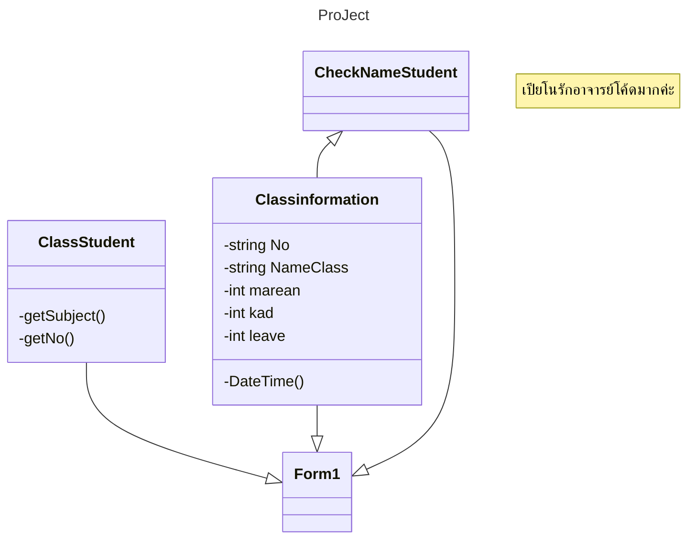

```mermaid
---
title: ProJect
---
classDiagram
    note "เปียโนรักอาจารย์โค้ดมากค่ะ"
    ClassStudent --|> Form1
    Classinformation --|> Form1
    CheckNameStudent <|-- Classinformation
    CheckNameStudent --|> Form1
    class Classinformation{
        -string No
        -string NameClass
        -int marean
        -int kad
        -int leave
        -DateTime()
    }
    class ClassStudent {
        -getSubject()
        -getNo()
    }
    
```
