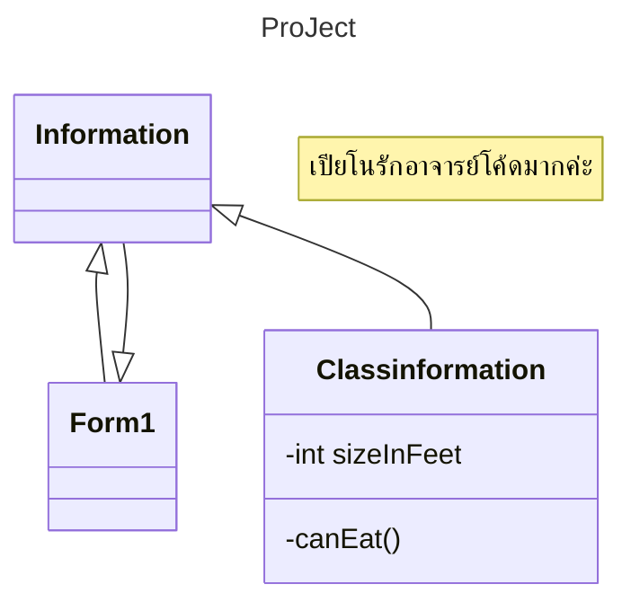

```mermaid
---
title: ProJect
---
classDiagram
    note "เปียโนรักอาจารย์โค้ดมากค่ะ"
    Information <|-- Form1
    Information --|> Form1
    Information <|-- Classinformation
    class Classinformation{
        -int sizeInFeet
        -canEat()
    }
    
```
