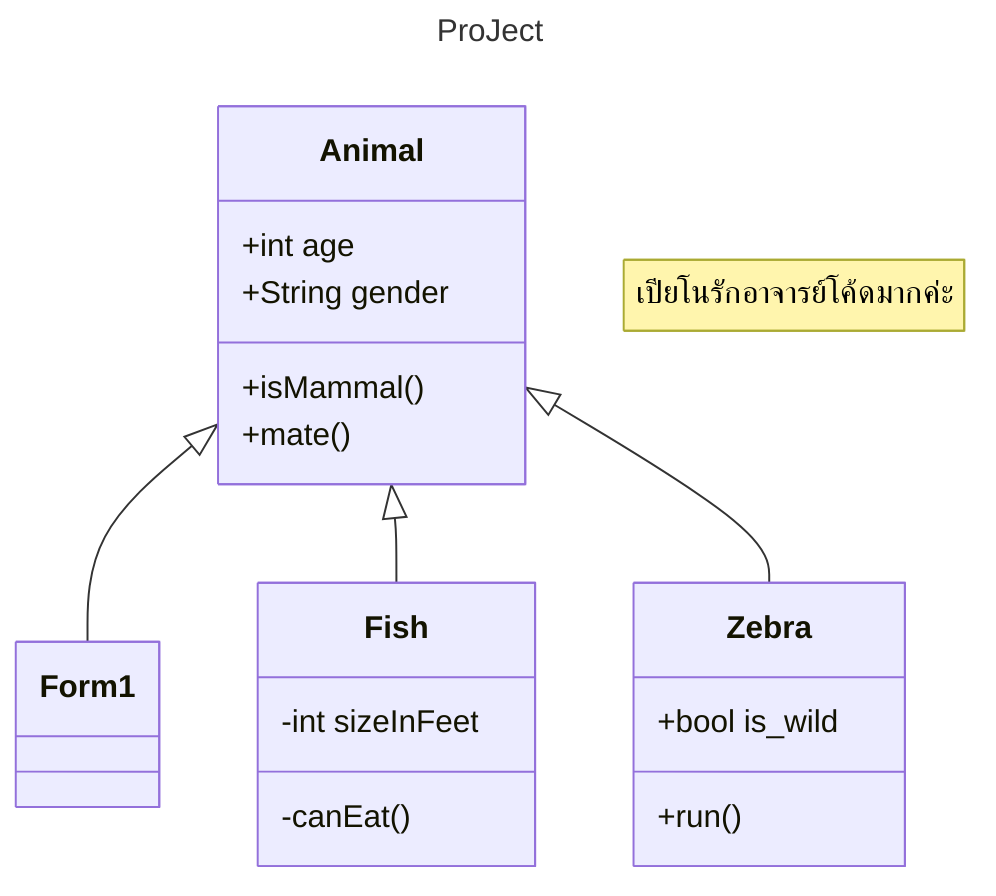

```mermaid
---
title: ProJect
---
classDiagram
    note "เปียโนรักอาจารย์โค้ดมากค่ะ"
    Animal <|-- Form1
    Animal <|-- Fish
    Animal <|-- Zebra
    Animal : +int age
    Animal : +String gender
    Animal: +isMammal()
    Animal: +mate()
    class Fish{
        -int sizeInFeet
        -canEat()
    }
    class Zebra{
        +bool is_wild
        +run()
    }
```
